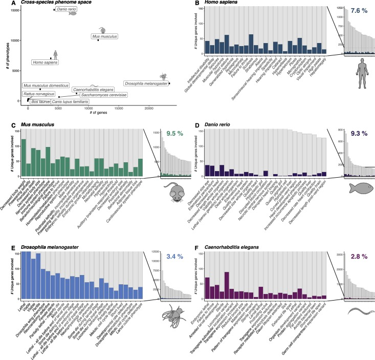
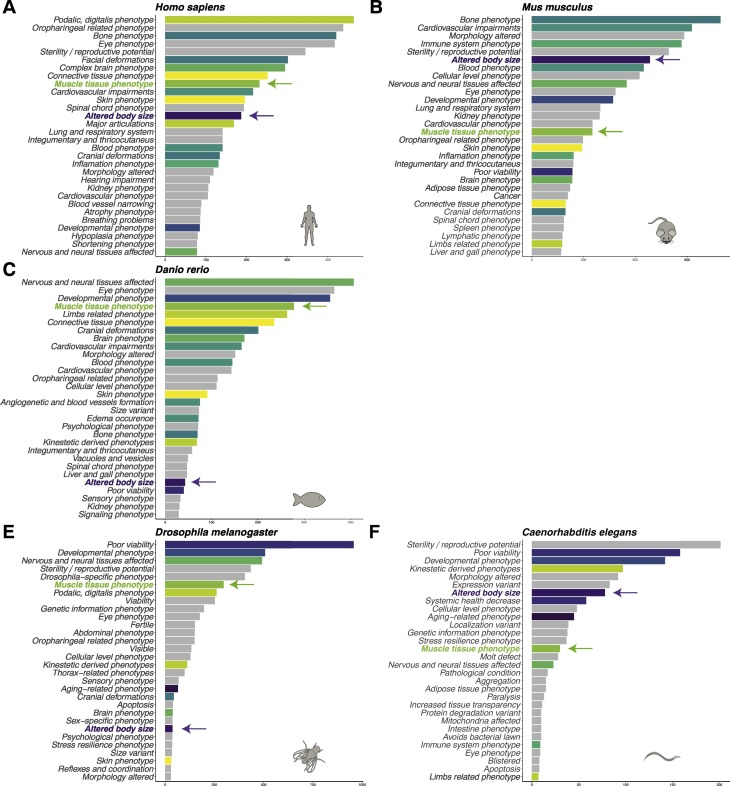
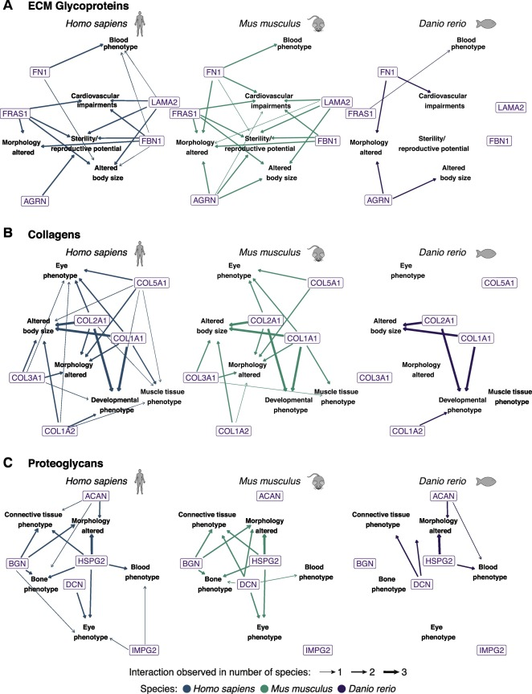

# Phenotype mining

## Available resources
- [Publication](https://doi.org/10.1016/j.mbplus.2020.100039) titled _The extracellular matrix phenome across species_.

## Disclaimer:
- Please contact me if you would like to utilize this code. The repository is not designed as a tool but as an effort of open science to share the code utilized in this publication. Several libraries need to be installed manually as well as orthology tables generated.

## Ongoing
- [ ] add google drive link to large start phenotype dataset.

## Publication preview
### The contribution of the matrisome to the phenome across species

### The matrisome-phenome across species

### Phenotypic implications of the structural matrisome categories on vertebrates
